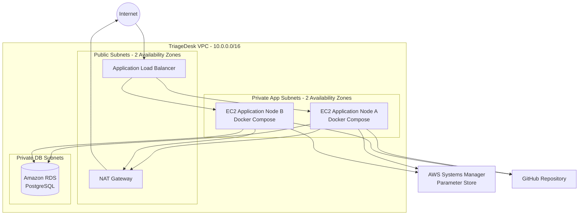
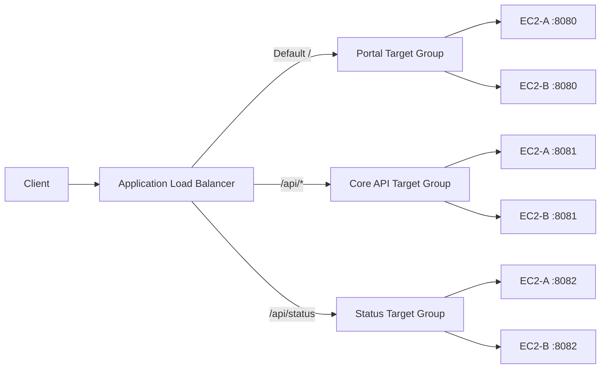

# TriageDesk

TriageDesk is a containerized IT Support Operations Portal designed to demonstrate practical infrastructure, Docker, Linux, networking, security, high availability, and AWS deployment skills.

The project started as a local Docker Compose environment and was then migrated to AWS using a highly available, multi-AZ architecture with an Application Load Balancer, Auto Scaling Group, Amazon RDS PostgreSQL, Systems Manager Parameter Store, a Golden AMI, and automated instance bootstrap.

---

## Project Goals

TriageDesk was built to demonstrate hands-on experience with:

- AWS VPC networking and subnet design
- Public and private network segmentation
- EC2 and Linux administration
- Docker and Docker Compose
- Application Load Balancing
- Path-based routing
- Auto Scaling and self-healing
- Dynamic scaling based on CPU utilization
- Amazon RDS PostgreSQL
- IAM roles and least-privilege access
- AWS Systems Manager Session Manager
- Parameter Store and SecureString secrets
- Golden AMI and Launch Templates
- Git and GitHub deployment workflows
- Health checks, failover, backup, restore, and validation

---

## Application Overview

TriageDesk contains three application services:

| Service | Port | Purpose |
|---|---:|---|
| Portal | `8080` | Web interface for tickets, assets, dashboard, and system status |
| Core API | `8081` | REST API for tickets, assets, and database operations |
| Status Service | `8082` | Runtime and application health information |

The AWS deployment uses Amazon RDS PostgreSQL as the shared database.

---

## Features

### Ticket Management

- View support tickets
- Create new incidents
- Update ticket status
- Update priority
- Assign technicians
- Ticket details page

### Asset Management

- View managed assets
- Asset details
- Device status
- Department and ownership information

### Operations Dashboard

- Open tickets
- Critical incidents
- Resolved incidents
- Managed assets
- Recent ticket activity
- Asset health overview

### System Status

- Portal health
- Core API health
- Status service health
- Runtime information

---

# Architecture

## AWS Architecture



Each EC2 instance is a complete TriageDesk application node running:

```text
EC2
└── Docker
    ├── Portal Container     :8080
    ├── Core API Container   :8081
    └── Status Container     :8082
```

Application state is not stored locally on the EC2 instances. Both nodes use the same private Amazon RDS PostgreSQL database.

---

## Application Load Balancer Routing

The ALB performs path-based routing:

```text
/                    -> Portal Target Group   -> EC2:8080
/api/*               -> Core API Target Group -> EC2:8081
/api/status          -> Status Target Group   -> EC2:8082
```

Request flow:



---

# AWS Network Design

The VPC is divided into six subnets across two Availability Zones.

| Layer | Subnet A | Subnet B |
|---|---|---|
| Public | `10.0.1.0/24` | `10.0.2.0/24` |
| Private App | `10.0.11.0/24` | `10.0.12.0/24` |
| Private DB | `10.0.21.0/24` | `10.0.22.0/24` |

### Routing

**Public subnets**

```text
0.0.0.0/0 -> Internet Gateway
```

Used by:

- Application Load Balancer
- NAT Gateway

**Private application subnets**

```text
0.0.0.0/0 -> NAT Gateway
```

Used by:

- Auto Scaling EC2 application nodes

The EC2 instances do not have public IPv4 addresses.

**Private database subnets**

No direct Internet route.

Used by:

- Amazon RDS PostgreSQL

---

# Security Design

Security Groups are chained instead of exposing application services directly to the Internet.

```text
Internet
   |
   | HTTP :80
   v
ALB Security Group
   |
   | TCP 8080 / 8081 / 8082
   v
Application Security Group
   |
   | PostgreSQL 5432
   v
Database Security Group
```

### ALB Security Group

Inbound:

```text
HTTP 80 <- 0.0.0.0/0
```

### Application Security Group

Inbound only from the ALB Security Group:

```text
TCP 8080 <- ALB SG
TCP 8081 <- ALB SG
TCP 8082 <- ALB SG
```

### Database Security Group

Inbound only from the application Security Group:

```text
PostgreSQL 5432 <- App SG
```

### Additional Security Controls

- EC2 instances use private IP addresses only
- No inbound SSH from the Internet
- Administration uses AWS Systems Manager Session Manager
- RDS is not publicly accessible
- Database credentials are not stored in GitHub
- Database password is stored as a Parameter Store `SecureString`
- EC2 uses an IAM role to retrieve application configuration
- EC2 Instance Metadata Service is configured for IMDSv2
- Application containers run as non-root users
- Nginx security headers were implemented in the local environment
- Application input validation and frontend output escaping were implemented

---

# Secrets and Configuration

AWS Systems Manager Parameter Store stores the database configuration:

```text
/triagedesk/prod/DB_HOST
/triagedesk/prod/DB_PORT
/triagedesk/prod/DB_NAME
/triagedesk/prod/DB_USER
/triagedesk/prod/DB_PASSWORD
```

`DB_PASSWORD` is stored as a `SecureString`.

The EC2 IAM role is restricted to the TriageDesk parameter path.

At boot time, User Data retrieves the parameters and creates the local `.env` file used by Docker Compose.

The `.env` file is excluded from Git.

---

# Golden AMI and Launch Template

A custom Golden AMI was created from Amazon Linux 2023.

The Golden AMI contains:

- Docker Engine
- Docker Compose
- Docker Buildx
- Git
- AWS CLI

It intentionally does not contain:

- Application source code
- Database credentials
- `.env`
- Runtime application data

The Launch Template uses the Golden AMI and configures:

- Instance type
- Application Security Group
- IAM instance profile
- IMDSv2
- Storage
- User Data bootstrap

User Data performs the remaining deployment automatically:

```text
Launch EC2
    |
    v
Clone latest TriageDesk source from GitHub
    |
    v
Read configuration from Parameter Store
    |
    v
Create .env
    |
    v
Start Docker Compose
    |
    v
Application becomes healthy
```

---

# Auto Scaling

The application runs in an EC2 Auto Scaling Group.

Configuration:

```text
Minimum capacity: 2
Desired capacity: 2
Maximum capacity: 4
```

The application nodes are distributed across two Availability Zones.

## Self-Healing

If one EC2 instance is terminated or becomes unhealthy:

```text
Instance failure
    |
    v
ASG detects capacity below desired
    |
    v
Launch Template creates replacement
    |
    v
Golden AMI boots
    |
    v
User Data deploys TriageDesk
    |
    v
New instance registers with Target Groups
```

Self-healing was tested by terminating an ASG-managed EC2 instance and verifying that the Auto Scaling Group automatically created a healthy replacement.

---

## Dynamic Scaling

A Target Tracking scaling policy is configured using average EC2 CPU utilization.

```text
Metric: Average CPU Utilization
Target: 50%
Instance warmup: 600 seconds
Scale in: Enabled
```

The test demonstrated:

```text
Normal state:
2 EC2 instances

High CPU load:
2 -> 3 -> 4 EC2 instances

Load removed:
4 -> 3 -> 2 EC2 instances
```

The ASG never scales below the configured minimum capacity of two instances.

---

# Load Balancing Validation

The Core API health endpoint returns both the EC2 instance ID and Docker container ID.

Example:

```json
{
  "assets": 3,
  "container": "788e7d175be4",
  "database": "connected",
  "instance": "i-0e9c377d9e75f7d64",
  "service": "core-api",
  "status": "ok",
  "tickets": 4
}
```

Repeated requests through the ALB returned different EC2 instance IDs, confirming that requests were distributed between multiple healthy application nodes.

Example PowerShell test:

```powershell
$ALB="http://YOUR-ALB-DNS"

1..10 | ForEach-Object {
    Invoke-RestMethod "$ALB/api/core-health"
}
```

---

# Database Migration to Amazon RDS

The local environment originally used PostgreSQL in Docker with persistent storage.

For AWS, the database was migrated to Amazon RDS PostgreSQL.

Migration flow:

```text
PostgreSQL Container
        |
        | pg_dump
        v
SQL Migration File
        |
        | psql restore
        v
Amazon RDS PostgreSQL
```

Database connectivity was validated from the private EC2 instance before migration.

The restored data was verified using record counts for both tickets and assets.

After validation, the PostgreSQL container was removed from the AWS deployment and the Core API was configured to use the private RDS endpoint.

---

# Local Environment

The project was first built and validated locally before AWS migration.

Local architecture:

```text
Browser
   |
   v
Nginx :8080
   |
   +---- Portal
   |
   +---- Core API
   |
   +---- Status Service
            |
            v
       PostgreSQL
```

Local implementation included:

- Docker Compose
- Nginx reverse proxy
- Docker network segmentation
- PostgreSQL persistence
- Health checks
- Multiple Core API replicas
- Nginx load balancing
- Failover testing
- Database backup and restore
- Backend validation
- XSS protection
- Non-root containers
- Security headers
- Docker log rotation
- Automated validation script

---

# Repository Structure

```text
triagedesk/
|
├── app/
│   ├── portal/
│   │   ├── Dockerfile
│   │   ├── app.py
│   │   ├── requirements.txt
│   │   ├── static/
│   │   └── templates/
│   |
│   ├── core-api/
│   │   ├── Dockerfile
│   │   ├── app.py
│   │   └── requirements.txt
│   |
│   └── status/
│       ├── Dockerfile
│       ├── app.py
│       └── requirements.txt
│
├── db/
│   └── init.sql
│
├── nginx/
│   └── nginx.conf
│
├── compose.yaml
├── compose.aws.yaml
├── validate.ps1
├── .env.example
├── .gitignore
└── README.md
```

---

# Local Deployment

Create the local environment file:

```bash
cp .env.example .env
```

Update the required database values, then run:

```bash
docker compose up -d --build
```

Open:

```text
http://localhost:8080
```

Validate:

```powershell
.\validate.ps1
```

The validation script checks:

- Container status
- HTTP endpoints
- Network exposure
- Non-root execution
- Nginx security headers

---

# AWS Deployment Model

The AWS Compose file does not run Nginx or PostgreSQL locally.

```text
compose.aws.yaml
├── Portal
├── Core API
└── Status Service
```

AWS provides:

```text
Nginx replacement      -> Application Load Balancer
PostgreSQL replacement -> Amazon RDS PostgreSQL
```

The application is automatically deployed to new Auto Scaling instances through the Launch Template and User Data.

---

# Health Endpoints

```text
Portal:
GET /health

Core API:
GET /health
GET /api/core-health

Status:
GET /health
GET /api/status
```

The ALB Target Groups use service health endpoints to determine whether an application node should receive traffic.

---

# Resilience Testing

The environment was tested for:

- Application container health
- ALB path-based routing
- Multi-instance load balancing
- EC2 instance failure
- Auto Scaling self-healing
- Dynamic scale-out
- Dynamic scale-in
- RDS connectivity
- Database migration
- Multi-AZ application placement

---

# Cost-Aware Lab Design

This project is designed as a hands-on AWS lab and portfolio project.

To reduce cost:

- One NAT Gateway was used instead of one per Availability Zone
- RDS was deployed as a single DB instance instead of Multi-AZ
- Small burstable EC2 and RDS instance classes were used
- Auto Scaling maximum capacity was limited to four instances

For a production environment, the architecture could be extended with:

- NAT Gateway per Availability Zone
- Multi-AZ RDS
- HTTPS using ACM
- Route 53 custom domain
- AWS WAF
- Centralized logging and monitoring
- CI/CD pipeline
- Container registry such as Amazon ECR
- ECS or EKS for independent service scaling

---

# Key Technical Decisions

### Why Docker on EC2?

Docker provides a consistent application runtime between the local development environment and AWS.

### Why multiple containers on each EC2?

Each EC2 acts as a complete application node. This keeps the lab architecture cost-efficient while still demonstrating:

- Docker
- ALB
- Target Groups
- Auto Scaling
- Multi-AZ
- Failover

A larger production environment could run each service in an independently scalable ECS/EKS service.

### Why RDS instead of PostgreSQL inside every EC2?

EC2 Auto Scaling nodes must remain stateless.

A PostgreSQL container on every instance would create separate databases and inconsistent application state.

Amazon RDS provides one shared private database for all application nodes.

### Why Parameter Store?

It prevents database credentials from being committed to source control or embedded directly into the Launch Template.

### Why Golden AMI?

It reduces instance bootstrap work by pre-installing the base operating system tools required by every application node while keeping application code and secrets outside the image.

---

# Technologies

### AWS

- Amazon VPC
- EC2
- Auto Scaling Groups
- Application Load Balancer
- Target Groups
- Amazon RDS PostgreSQL
- Systems Manager Session Manager
- Systems Manager Parameter Store
- IAM
- Golden AMI
- Launch Templates
- NAT Gateway
- Internet Gateway
- Security Groups

### Application / Infrastructure

- Python
- Flask
- PostgreSQL
- Docker
- Docker Compose
- Nginx
- Linux
- Git
- GitHub
- PowerShell

---

# Project Status

```text
Local Docker Environment        Complete
AWS Network Architecture       Complete
Private EC2 Deployment         Complete
RDS Migration                  Complete
ALB Path-Based Routing         Complete
Golden AMI                     Complete
Launch Template                Complete
Auto Scaling                   Complete
Self-Healing                   Complete
Dynamic Scaling                Complete
Security Hardening             Complete
```

---

## Notes

This repository is a portfolio and hands-on infrastructure project. The AWS deployment intentionally balances production-style architecture with lab cost control.

Do not commit:

- `.env`
- database passwords
- AWS credentials
- generated database backups
- private keys
